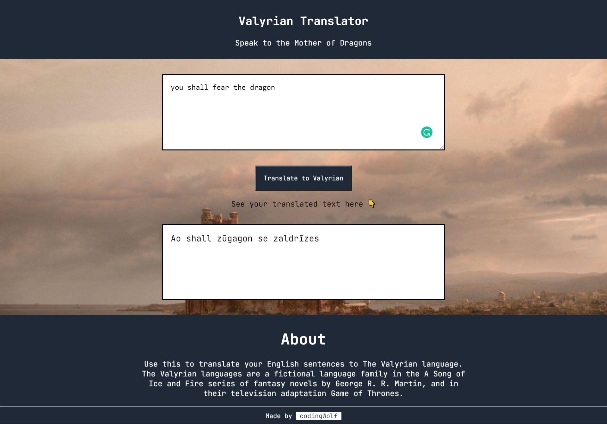

# Valyrian-Translator-GOT

A text translation app built while attending Neogcamp Web Dev Bootcamp. It can convert your English text to Valyrian language spoken by Daenerys Targaryen (The Mother of Dragons) of Game of Thrones.

## Made using

- HTML
- CSS
- JavaScript

## API used

- Fun Translation - [Link](https://funtranslations.com/)
